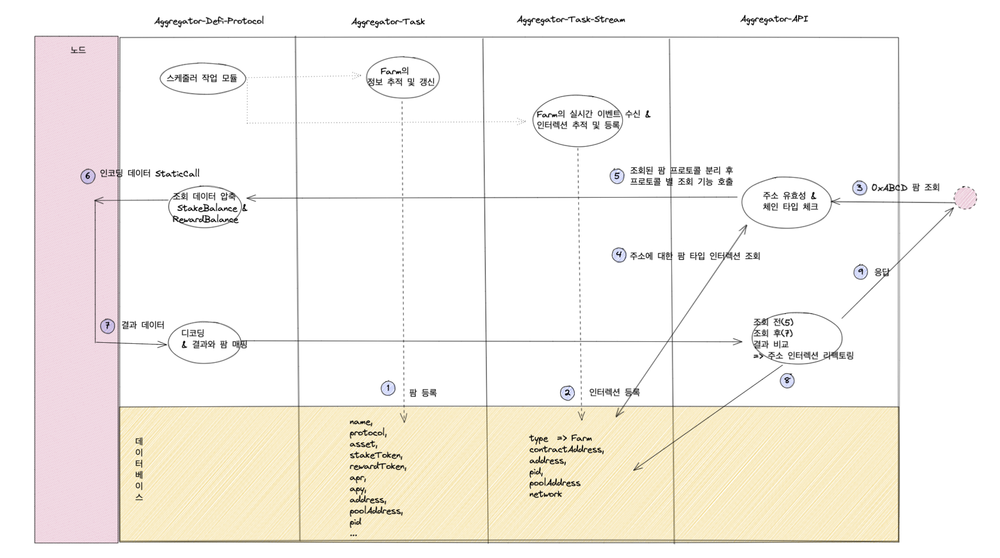

# aggregator-readme

## Description

---

어그리게이터 프로젝트

## Precondition

1. node v14+
2. mysql
3. redis

<br/><br/>

## Aggreagator-Project

### **Packages**

| 패키지 명                    |                      description                       |                         repository | version                                                                                        |
| :--------------------------- | :----------------------------------------------------: | ---------------------------------: | ---------------------------------------------------------------------------------------------- |
|                              |
| **Aggregator-Common**        |                       공통 모듈                        |        cseongeun/aggregator-common |                |
|                              |
| **Aggregator-Util**          |                        유틸리티                        |          cseongeun/aggregator-util |                    |
|                              |
| **Aggregator-Base**          | 공통 엔티디, 레포지토리, 상수, 인터페이스, DTO, 서비스 |          cseongeun/aggregator-base |                    |
|                              |
| **Aggregator-Defi-Protocol** |                  디파이 프로토콜 모듈                  | cseongeun/aggregator-defi-protocol |  |
|                              |

- 패키지 버전 업데이트 스크립트

  ```bash
  $ npm run deploy    // 1) npm run build  2) npm version patch 3) npm publish
  ```

  <br/>

### **Services**

| 서비스 명                  |   description    |                       repository |
| :------------------------- | :--------------: | -------------------------------: |
|                            |
| **Aggregator-Task**        |  반복 작업 모듈  |        cseongeun/aggregator-task |
|                            |
| **Aggregator-Task-Stream** | 스트림 작업 모듈 | cseongeun/aggregator-task-stream |
|                            |
| **Aggregator-Api**         |       API        |         cseongeun/aggregator-api |

<br/><br/>

## 어그리게이터 프로젝트 세팅

-

- 어그리게이터 세팅

```bash
$ git clone [aggregator-base repository]

$ cd aggregator-base

$ cp .env.example .env

********* .env 데이터 삽입 *******

$ npm i

$ npm run migration:generate init // 마이그레이션 생성

$ npm run migration:run  // 마이그레이션 진행

$ npm run seed:run   // 초기 시드 삽입
```

- 어그리게이터 작업 실행

```bash
$ git clone [aggregator-task]

$ cd aggregator-task

$ cp .env.example .env

********* .env 데이터 삽입 *******

$ npm i

$ npm run start
```

- 어그리게이터 스트림 작업 실행

```bash
$ git clone [aggregator-task-stream]

$ cd aggregator-task-stream

$ cp .env.example .env

********* .env 데이터 삽입 *******

$ npm i

$ npm run start
```

<br/> <br/>

## Aggregator Task(어그리게이터 작업)

<!-- ### 작업 단위 구조

> Module
>
> > Protocol ex) pancake-swap
> >
> > > Network ex) binance-smart-chain, polygon
> > >
> > > > Task ex) farm, nft -->

## Aggregator Task Stream(어그리게이터 스트림 작업)

### 플로우


`Interaction(인터렉션)?`

    **인터렉션은 특정 주소가 어떠 컨트랙트와 거래를 진행했는지 또는 컨트랙트의 몇 번째 pid에 대해 거래를 진행했는지 확인하기 위함<리소스 낭비 최소화>**

    1) 특정 주소가 지갑 내 자산 조회 요청을 진행할 경우
    과거 토큰 타입의 컨트랙트와 거래한 이력이 있으면 해당 컨트랙트 주소에 대해서만 잔액 조회를 진행하면됨


    2) 특정 주소가 팜의 스테이킹 수량과 리워드 수량 조회 요청을 진행할 경우 (렌딩 컨트랙트의 공급 수량과 대출 수량)
    과거 팜 타입의 컨트랙트의 특정 pid와의 거래 내역이 있다면 해당 pid에 대한 스테이킹 수량과 리워드 수량을 조회하면 됨
    => 팬케이크 팜 인덱스 300개, 각각 스테이킹 수량과 리워드 수량을 조회한다면 600번의 콜

`레디스 적용`

    **실시간 이벤트 처리**

## Aggregator API(어그리게이터 API)

### Farm 조회


