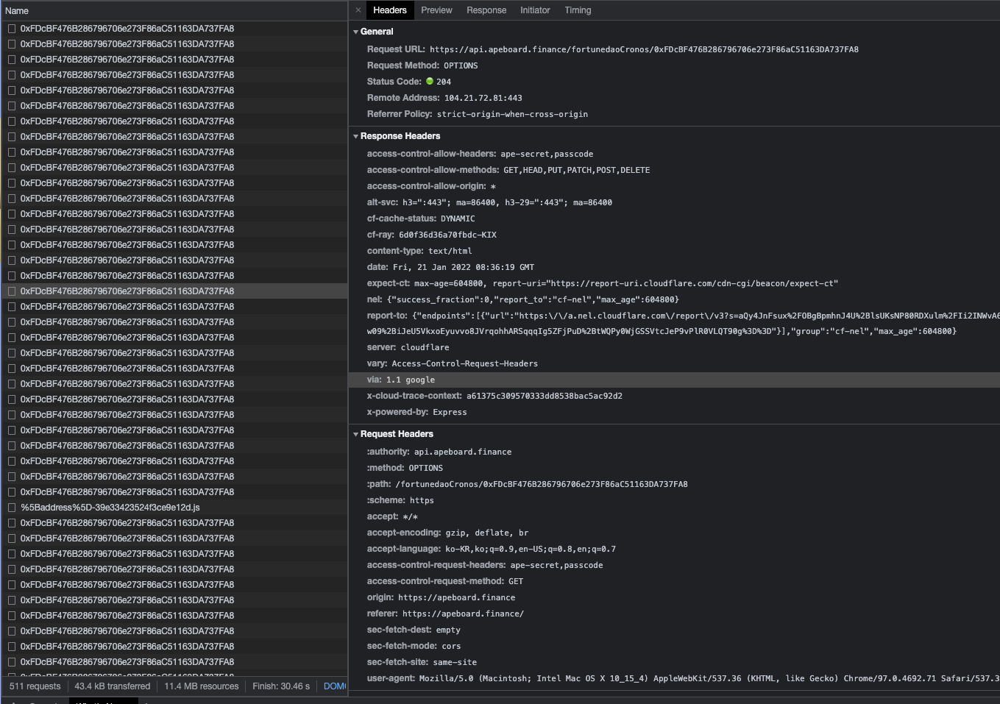

# https://apeboard.finance/

## 주소 조회 시

1. 모든 프로토콜에 각 각 팜, 덱스, 렌딩, 금고 등 정보 조회
2. 모든 네트워크에 각 각 자산 조회

## 특징

1. 주소의 자산 가치 산출할 때, 알려지지않은 토큰에 대해서는 자산 가치에 추가시키지않음
2. LP에 대해 분리했을 때의 Underlying Token 갯수까지 보여줌
3. NFT 갤러리 존재
4. 다중 토큰들을 단일 토큰으로 스왑하는 기능(Ape Blender)
5. 브릿지 존재 (타 서비스 연결)

### 페이지 첫 로딩 요청



- 자산 조회
  https://api.apeboard.finance/wallet/[네트워크]/[주소]

  response:

  ```
  [
    {
      "address":"0xc7198437980c041c805a1edcba50c1ce5db95118",
      "symbol":"USDT.e",
      "logo":"https://raw.githubusercontent.com/ava-labs/avalanche-bridge-resources/main/tokens/USDT/logo.png",
      "decimals":6,
      "chain":"AVAX",
      "name":"Tether USD",
      "isNative":false,
      "extensions": {
        "coingeckoId":"tether"
      },
      "price":1,
      "source":"COINGECKO",
      "isBlacklisted":false,
      "isHidden":false,
      "reportCount":3,
      "createdAt":"2021-08-23T09:32:03.847Z",
      "modifiedAt":"2022-01-21T08:20:30.251Z",
      "balance":0.00102
    },
    {
      "address":"0xd586e7f844cea2f87f50152665bcbc2c279d8d70",
      "symbol":"DAI.e",
      "logo":"https://raw.githubusercontent.com/ava-labs/avalanche-bridge-resources/main/tokens/DAI/logo.png",
      "decimals":18,
      "chain":"AVAX",
      "name":"Dai Stablecoin",
      "isNative":false,
      "extensions": {
        "coingeckoId":"dai"
      },
      "price":1,
      "source":"COINGECKO",
      "isBlacklisted":false,
      "isHidden":false,
      "reportCount":0,
      "createdAt":"2021-08-23T09:08:49.331Z",
      "modifiedAt":"2022-01-21T06:50:44.227Z",
      "balance":0.0014566812
    },
  ```

- 프로토콜 서비스 조회

https://api.apeboard.finance/[프로토콜-네트워크]/[주소]

덱스 포지션 - <https://api.apeboard.finance/quickswapPolygon/0xFDcBF476B286796706e273F86aC51163DA737FA8> <br/>
response:

```
{
  "positions": [
    {
      "lpAddress":"0xf6422b997c7f54d1c6a6e103bcb1499eea0a7046",
      "balance":6e-10,
      "tokens": [
        {
          "address":"0x7ceb23fd6bc0add59e62ac25578270cff1b9f619",
          "symbol":"WETH",
          "logo":"https://tokens.1inch.exchange/0x7ceb23fd6bc0add59e62ac25578270cff1b9f619.png","decimals":18,
          "chain":"POLYGON",
          "name":"Wrapped Ether",
          "isNative":false,
          "extensions":{
            "coingeckoId":"weth"
          },
          "price":2890.79,
          "source":"COINGECKO",
          "isBlacklisted":false,
          "isHidden":false,
          "reportCount":13,
          "createdAt":"2021-06-25T19:07:42.576Z",
          "modifiedAt":"2022-01-21T08:30:40.409Z",
          "balance":0.000279842275840048
        },
      ],
    }
  ]
```

덱스 포지션, 팜, syrup, vault - <https://api.apeboard.finance/apeswapBsc/0xFDcBF476B286796706e273F86aC51163DA737FA8>
<br/>

response:

```
{
  "positions":[],
  "farms":[
    {
      "poolAddress":"0x5c8D727b265DBAfaba67E050f2f739cAeEB4A6F9",
      "lpAddress":"0x603c7f932ed1fc6575303d8fb018fdcbb0f39a95",
      "balance":3.5216733307123467,
      "tokens":[
        {
          "address":"0x603c7f932ed1fc6575303d8fb018fdcbb0f39a95",
          "symbol":"BANANA",
          "logo":"https://tokens.1inch.exchange/0x603c7f932ed1fc6575303d8fb018fdcbb0f39a95.png","decimals":18,
          "chain":"BSC",
          "name":"ApeSwapFinance Banana",
          "isNative":false,
          "extensions":{
            "coingeckoId":"apeswap-finance"
          },
          "price":0.684689,
          "source":"COINGECKO",
          "isBlacklisted":false,
          "isHidden":false,
          "reportCount":13,
          "createdAt":"2021-06-25T19:07:42.576Z",
          "modifiedAt":"2022-01-21T08:30:40.409Z",
          "balance":3.5216733307123467
        }
      ],
      "rewards":[
        {
          "address":"0x603c7f932ed1fc6575303d8fb018fdcbb0f39a95",
          "symbol":"BANANA",
          "logo":"https://tokens.1inch.exchange/0x603c7f932ed1fc6575303d8fb018fdcbb0f39a95.png","decimals":18,
          "chain":"BSC",
          "name":"ApeSwapFinance Banana",
          "isNative":false,
          "extensions":{
            "coingeckoId":"apeswap-finance"
          },
          "price":0.684689,
          "source":"COINGECKO",
          "isBlacklisted":false,
          "isHidden":false,
          "reportCount":13,
          "createdAt":"2021-06-25T19:07:42.576Z",
          "modifiedAt":"2022-01-21T08:30:40.409Z",
          "balance":1.2571364081399143
        }
      ],
      "apr":76.7647174140533
    }
  ],
  "syrup":[],
  "vaults":[]
}
```
