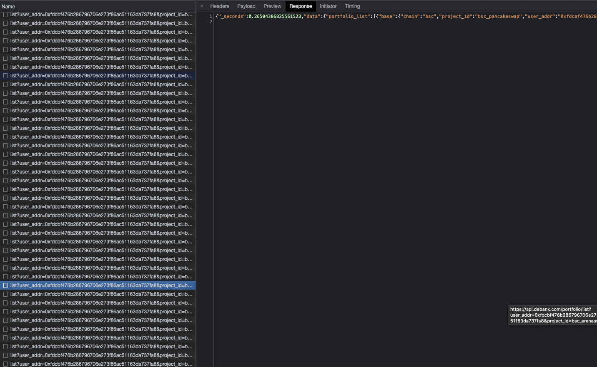

# https://apeboard.finance/

## 주소 조회 시

1. 모든 프로토콜에 각 각 팜, 덱스, 렌딩, 금고 등 정보 조회
2. 모든 네트워크에 각 각 자산 조회

## 특징

1. 네트워크 별 풀 히스토리 보유 (렌딩시 요청하는 것 보면 확인 가능)
2. 주소의 Approval 리스트 확인 가능
3. 주소 Verify 서명
4. 프로토콜 추가에 대한 DAO

### 페이지 첫 로딩 요청



- 자산 조회
  https://api.apeboard.finance/wallet/[네트워크]/[주소]

  response:

  ```
  [
    {
      "address":"0xc7198437980c041c805a1edcba50c1ce5db95118",
      "symbol":"USDT.e",
      "logo":"https://raw.githubusercontent.com/ava-labs/avalanche-bridge-resources/main/tokens/USDT/logo.png",
      "decimals":6,
      "chain":"AVAX",
      "name":"Tether USD",
      "isNative":false,
      "extensions": {
        "coingeckoId":"tether"
      },
      "price":1,
      "source":"COINGECKO",
      "isBlacklisted":false,
      "isHidden":false,
      "reportCount":3,
      "createdAt":"2021-08-23T09:32:03.847Z",
      "modifiedAt":"2022-01-21T08:20:30.251Z",
      "balance":0.00102
    },
    {
      "address":"0xd586e7f844cea2f87f50152665bcbc2c279d8d70",
      "symbol":"DAI.e",
      "logo":"https://raw.githubusercontent.com/ava-labs/avalanche-bridge-resources/main/tokens/DAI/logo.png",
      "decimals":18,
      "chain":"AVAX",
      "name":"Dai Stablecoin",
      "isNative":false,
      "extensions": {
        "coingeckoId":"dai"
      },
      "price":1,
      "source":"COINGECKO",
      "isBlacklisted":false,
      "isHidden":false,
      "reportCount":0,
      "createdAt":"2021-08-23T09:08:49.331Z",
      "modifiedAt":"2022-01-21T06:50:44.227Z",
      "balance":0.0014566812
    },
  ```

- 프로토콜 서비스 조회

https://api.debank.com/portfolio/list?user_addr=[주소]&project_id=[네트워크-프로토콜]

덱스 포지션 - <https://api.debank.com/portfolio/list?user_addr=0xfdcbf476b286796706e273f86ac51163da737fa8&project_id=bsc_bakeryswap

> <br/>
> response:

```
{
  "_seconds":0.2251288890838623,
  "data":{
    "portfolio_list":[
      {
        "base": {
        "chain":"bsc",
        "project_id":"bsc_bakeryswap",
        "user_addr":"0xfdcbf476b286796706e273f86ac51163da737fa8"
        },
        "detail":{
          "reward_token_list":[
            {
              "amount":0.01076711548014592,
              "chain":"bsc",
              "decimals":18,
              "display_symbol":null,
              "id":"0xe02df9e3e622debdd69fb838bb799e3f168902c5",
              "is_core":true,
              "is_verified":true,
              "is_wallet":true,
              "logo_url":"https://static.debank.com/image/bsc_token/logo_url/0xe02df9e3e622debdd69fb838bb799e3f168902c5/063cdd51395ab49e2f05bbc762252c0e.png",
              "name":"BakeryToken",
              "optimized_symbol":"BAKE",
              "price":0.8524454313011784,
              "protocol_id":"bsc_bakeryswap",
              "symbol":"BAKE",
              "time_at":1599984664.0
            }
          ],
          "supply_token_list":[
            {
              "amount":4.004073368466532,
              "chain":"bsc",
              "decimals":18,
              "display_symbol":null,
              "id":"0x55d398326f99059ff775485246999027b3197955",
              "is_core":true,
              "is_verified":true,
              "is_wallet":true,
              "logo_url":"https://static.debank.com/image/bsc_token/logo_url/0x55d398326f99059ff775485246999027b3197955/66eadee7b7bb16b75e02b570ab8d5c01.png",
              "name":"Tether USD",
              "optimized_symbol":"USDT",
              "price":1.0,
              "protocol_id":"",
              "symbol":"USDT",
              "time_at":1599201028.0
            },
            {
              "amount":4.0105224878478625,
              "chain":"bsc",
              "decimals":18,
              "display_symbol":null,
              "id":"0xe9e7cea3dedca5984780bafc599bd69add087d56",
              "is_core":true,
              "is_verified":true,
              "is_wallet":true,
              "logo_url":"https://static.debank.com/image/bsc_token/logo_url/0xe9e7cea3dedca5984780bafc599bd69add087d56/f0825e572298822e7689fe81150a195d.png",
              "name":"BUSD Token",
              "optimized_symbol":"BUSD",
              "price":1.0,
              "protocol_id":"",
              "symbol":"BUSD",
              "time_at":1599044503.0
            }
          ]
        },
        "detail_types":["common"],
        "name":"Farming",
        "proxy_detail":{},
        "stats":{
          "asset_usd_value":8.023774234713736,
          "debt_usd_value":0,
          "net_usd_value":8.023774234713736
        },
        "update_at":1642755756.2335346
      },
    }
  ]
}

```
